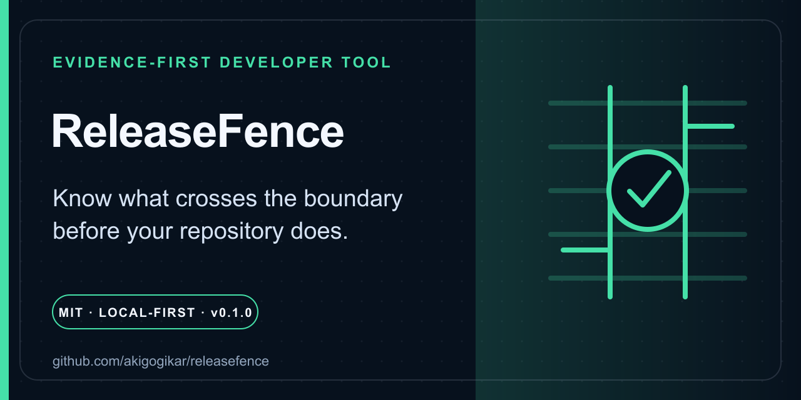

# ReleaseFence

[](https://github.com/akigogikar/releasefence/actions/workflows/ci.yml)
[](LICENSE)



**Know what crosses the boundary before your repository does.**

ReleaseFence is a local preflight for teams preparing a repository for open-source review. It turns release-boundary risks into deterministic JSON and a self-contained HTML report with the exact path, line, evidence, severity, and remediation behind every finding.

**Status:** 0.1.0 alpha. Source installation is supported; no package registry publication has occurred. A clean report is useful evidence, not legal advice, ownership proof, secret discovery, or permission to publish.

## Why ReleaseFence

- **Local by design:** the scanner makes no network requests and the HTML loads no remote assets.
- **Evidence before scores:** every result points to a reproducible local fact instead of an opaque readiness grade.
- **Stable automation:** reports omit timestamps and absolute checkout paths, so identical trees produce identical JSON.
- **One boundary view:** license declarations, provenance, internal endpoints, remotes, registries, submodules, symlinks, binaries, large files, and Git LFS are reviewed together.

## Copy-paste demo

```sh
git clone https://github.com/akigogikar/releasefence.git
cd releasefence
python3 -m venv .venv
. .venv/bin/activate
python -m pip install .
releasefence scan examples/amber --json /tmp/releasefence.json --html /tmp/releasefence.html
```

Expected: exit 0, `status: "amber"`, and one evidence-linked submodule-lineage warning. On Windows PowerShell, activate with `.venv\Scripts\Activate.ps1` and replace `/tmp/...` with a local path.

Already installed? The complete interface starts with one command:

```sh
releasefence scan /path/to/repository --json report.json --html report.html
```

The default `--fail-on error` exits 1 for error or critical findings. Accepted thresholds are `none`, `warning`, `error`, and `critical`; invalid input exits 2. Use `--json -` for stdout.

## Reproducible examples

```sh
python3 releasefence.py scan examples/green --json /tmp/releasefence-green.json --html /tmp/releasefence-green.html
python3 releasefence.py scan examples/amber --json /tmp/releasefence-amber.json --html /tmp/releasefence-amber.html
python3 releasefence.py scan examples/red --json /tmp/releasefence-red.json --html /tmp/releasefence-red.html --fail-on none
```

Expected statuses are green, amber, and red respectively.

## Help shape 0.2

The best first contributions are small improvements to a rule, fixture, diagnostic, or accessibility check—not new infrastructure. Start with the five code-aware [issue seeds](docs/ISSUE_SEEDS.md), then read [CONTRIBUTING.md](CONTRIBUTING.md). A focused 2–4 hour contribution with a synthetic proof is welcome.

## Install and support

ReleaseFence supports Python 3.10–3.14 and has no runtime dependencies. CI tests every supported Python version on Linux and Python 3.14 on macOS and Windows.

- Questions and false positives: [support](SUPPORT.md) and [troubleshooting](docs/TROUBLESHOOTING.md)
- Vulnerabilities or sensitive findings: [private security reporting](SECURITY.md)
- Compatibility: [API stability](docs/API_STABILITY.md) and [changelog](CHANGELOG.md)

## Project navigation

- Design: [architecture](docs/ARCHITECTURE.md), [privacy](docs/PRIVACY.md), and [accessibility](docs/ACCESSIBILITY.md)
- Direction: [roadmap](ROADMAP.md), [launch kit](docs/LAUNCH_KIT.md), and [governance](GOVERNANCE.md)
- Participate: [contributing](CONTRIBUTING.md), [code of conduct](CODE_OF_CONDUCT.md), and [issue seeds](docs/ISSUE_SEEDS.md)
- Boundaries: [scope](SCOPE.md), [provenance](PROVENANCE.md), and [optional ecosystem](ECOSYSTEM.md)

## Test

```sh
python3 -m unittest discover -s tests -v
```

## Honest limitations

License recognition and URL classification are bounded heuristics. Text inspection stops at 2 MB per file; binaries and larger files are flagged rather than decoded. ReleaseFence does not determine copyright ownership, contractual restrictions, patent risk, credential leakage, or remote repository visibility. Human ownership, legal, security, accessibility, and contractual review remain necessary.

Released under the [MIT License](LICENSE).
